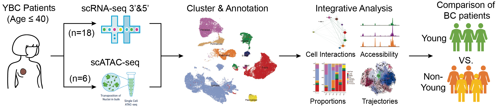

# Atlas of Breast Cancer in Chinese Young Women Revealed by Single-cell RNA and ATAC Sequencing

**✨NEWS:** Our paper is now available on bioRxiv.[[preprint link\]](https://www.biorxiv.org/content/10.1101/2025.10.16.682857v1)

> This repository contains the complete single-cell RNA and ATAC sequencing analysis pipeline for the study "Atlas of Breast Cancer in Chinese Young Women Revealed by Single-cell RNA and ATAC Sequencing". It includes data processing, downstream analysis, and visualization scripts to reproduce the study's results.

## Overview

Young women with breast cancer (YBC, age⩽40) are particularly prevalent in Asian. YBCs usually show more aggressive pathology and poorer outcomes than non-young patients. However, YBCs are underrepresented in current BC risk models, with their tumor-intrinsic subtypes and microenvironments lacking systematic elucidation at the single-cell level, thereby limiting the development of young-specific therapies. This study aims to elucidate the underlying biological mechanisms of poor outcomes in YBC patients, thereby promoting potential insights into young-specific therapeutic interventions.

We established a single-cell Chinese YBC landscape baseline, including 246,659 cells, by applying scRNA-seq and scATAC-seq on untreated patients. We developed a cross-modal feature selection algorithm to construct a young-intrinsic subtype classifier ‘BCYtype’, outperforming existing classifiers in pseudobulk, cellular, and external cohorts. 



**Highlights**

- Single-cell RNA and ATAC atlases reveal intertumoral and intratumoral heterogeneity in YBCs.

- Tumor cells in younger patients undergo earlier carcinogenesis with higher differentiation potential.

- We developed a new intrinsic subtype classifier, BCYtype, and found twelve young-specific genes.

- NKG2A represents a potential therapeutic target for the TNBC subtype in YBCs.

## Instructions

#### 1. System Requirements

The codes have been implemented on Ubuntu 22.04 LTS and macOS Sequoia 15.6.1. The installation on other operating systems (Windows) should be cautious due to Python packages.

#### 2. Packages and Installation

The codes require Python 3.8 or later and R 4.1.0 or later. The required Python packages are listed in the file requirements.txt, and the required R packages are managed using `renv`.

✨ To install the Python environment, you can run the command in the terminal:

```shell
git clone https://github.com/lyotvincent/BCY-analysis.git
cd BCY-analysis
pip install -r requirements.txt
Rscript install_renv.r
```

#### 3. Repository Structure

```
.
├── .gitignore               # Ignored files (e.g., virtual environment, large data)
├── README.md                # Project documentation (this file)
├── requirements.txt         # Dependencies for Python environment
├── analysis/                # Downstream analysis scripts (no raw data processing)
│   ├── 00_BCY_major.ipynb  # Integrated analysis of major cell types
│   ├── 01_BCY_normal-epi.ipynb  # Normal epithelial cell characterization
│   ├── 02_BCY_malig-epi.ipynb  # Malignant epithelial cell analysis
│   ├── 03_BCY_NMF.ipynb    # Meta program analysis via NMF
│   ├── 04_BCY_T-cell.ipynb # Tumor-infiltrating T/NK/NKT cell characterization
│   ├── 05_BCY_Tex.ipynb    # Exhausted T cell subset analysis
│   ├── 06_BCY_TCR.ipynb    # TCR repertoire analysis
│   ├── 07_BCY_Mye.ipynb    # Myeloid cell (macrophages/DCs) analysis
│   └── 08_BCY_Str.ipynb    # Stromal cell (fibroblasts/endothelial) analysis
├── data/                    # Preprocessed data files (ready for analysis)
│   ├── adata-*.h5ad        # AnnData objects (single-cell expression + metadata)
│   └── gene_pos.txt        # Gene position annotation file
├── figures/                 # Output directory for generated figures (empty initially)
└── processing/              # Raw data preprocessing scripts
    ├── 01_pp_epi_norm.ipynb  # Normal epithelial cell preprocessing (QC, filtering)
    ├── 02_pp_epi_concat.ipynb  # Integration of epithelial cells across samples
    └── 03_pp_T-cells.ipynb    # T cell data preprocessing (QC, clustering, annotation)
```

###### Key Directory Descriptions

**data/**

- Contains all **preprocessed data** in `h5ad` format (AnnData objects), which include filtered expression matrices, cell annotations, clustering results, and metadata. Due to the large file size of these preprocessed datasets, they are not included in their entirety in this repository. To obtain the complete preprocessed data for analysis or figure reproduction, please contact the corresponding authors directly.
- Ready for direct use in downstream analysis (no need for raw data processing).
- Key files:
  - `adata-concat.h5ad`: Integrated single-cell dataset of all cell types.
  - `adata-epi-cnv.h5ad`: Epithelial cells with CNV calls (malignant vs. benign classification).
  - `adata-YBC-*/adata-OBC-*`: Subset datasets for young breast cancer (YBC) and non-young breast cancer (OBC) by cell type.

**processing/**

- Scripts for **raw data preprocessing** (input: raw sequencing data; output: `data/` directory files).
- Core functions include:
  - Quality control (filtering low-quality cells/doublets).
  - Batch effect correction and data normalization.
  - Dimensionality reduction (PCA, UMAP) and unsupervised clustering.
  - Cell type annotation (based on canonical markers and CNV analysis).
- Run these scripts first if you need to reprocess raw data (raw sequencing data available via GSA-Human: HRA012799).

**analysis/**

- Scripts for **downstream analysis** (input: preprocessed data from `data/`; no raw data manipulation).
- Core analyses include:
  - Differential gene expression (DEG) analysis between groups.
  - Pathway enrichment (GSEA, GO/KEGG) and meta program identification.
  - Pseudotime trajectory analysis (cell differentiation paths).
  - TCR clonal expansion and immune cell interaction analysis.
  - Visualization of key results (UMAP, heatmaps, violin plots).
- **Quick figure reproduction**: To rapidly recreate the figures published in the study, directly run the Jupyter Notebooks in the `analysis/` directory (sequential order recommended: 00 → 08). All figure-related code is embedded in these notebooks, with outputs saved to the `figures/` directory.

**figures/**

- Empty directory to store output figures (generated by `analysis/` scripts).
- All figures from the study (e.g., UMAP visualizations, heatmaps, pathway plots) can be reproduced here.

#### 4. Data availability 

- Raw sequencing data: GSA-Human (accession: HRA012799) → https://ngdc.cncb.ac.cn/gsa-human/
- Preprocessed data: Included in the `data/` directory of this repository (for quick analysis).
- External datasets used for comparison:
  - GSE161529 (YBC single-cell RNA-seq)
  - GSE176078 (non-young BC single-cell RNA-seq)
  - HRA000477 (non-young BC single-cell atlas)

 For questions or issues related to the code/data, please contact:

- Jian Liu (jianliu@nankai.edu.cn)

For technical support, open an issue in the GitHub repository.